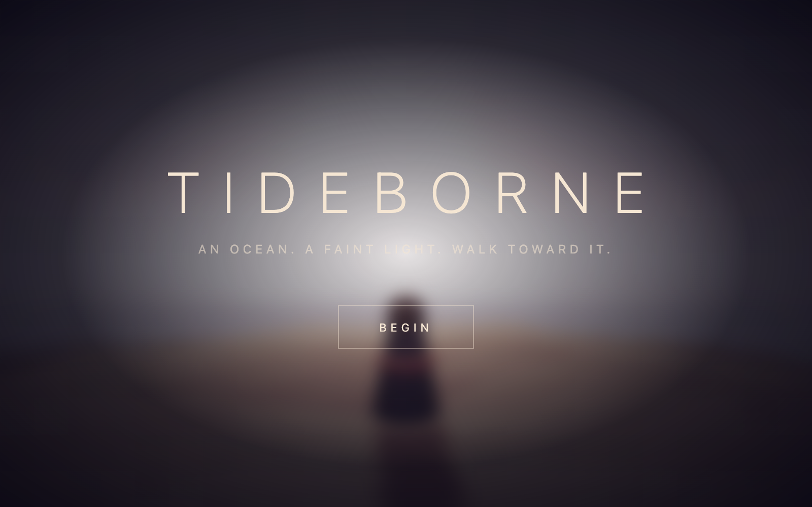
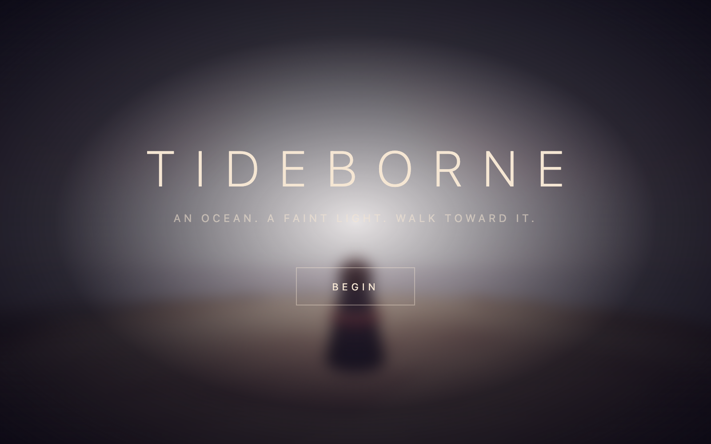
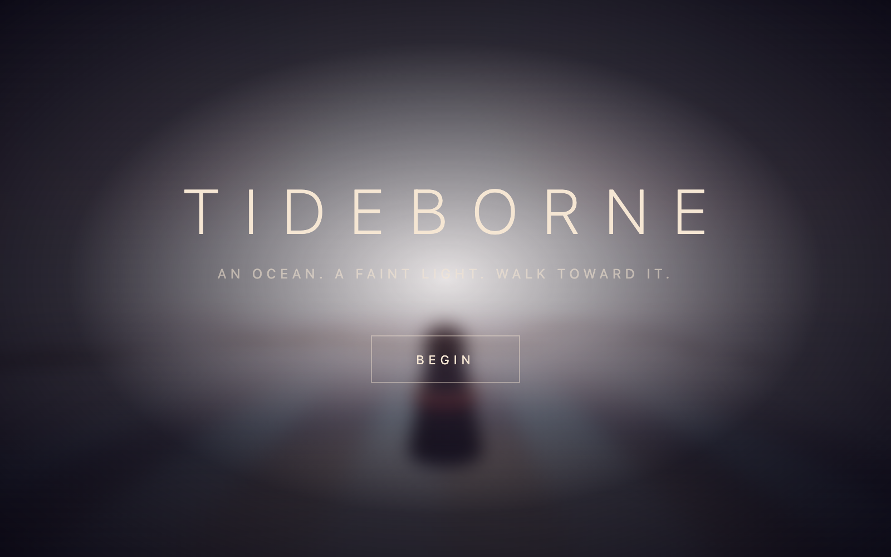

<div align="center"></div>

# 🌊 TIDEBORNE

**Un océano. Una luz tenue a lo lejos. Camina hacia ella.**

[](https://gavilanbe.github.io/3dish/)


---

## Qué es esto

**Tideborne** es una experiencia de exploración en primera persona, atmosférica y minimalista, construida con WebGL en el navegador. Apareces sobre un océano oscuro e infinito. No hay tutoriales, no hay menús cargados: solo tú, el agua, y una luz lejana que parpadea en el horizonte. Caminas. Escuchas. Recoges lo que la marea trajo consigo.

Todo corre en tiempo real con **React Three Fiber** y **Three.js**, con físicas reales, postprocesado (bloom) y shaders GLSL personalizados para el agua y la luz.

## 📖 La historia

Naciste de la marea —*tideborne*—, sin recuerdos, sobre la superficie de un mar que no tiene orillas. En la distancia, un faro emite una luz débil e intermitente, como un latido. Es lo único que rompe la oscuridad.

A medida que avanzas hacia esa luz, el océano va devolviendo **fragmentos**: pequeños destellos que la corriente ha arrastrado durante mucho tiempo. Cada fragmento que recoges es un fragmento de algo que fuiste, o que serás. Reúne los **30 fragmentos** y deja que la luz del faro vuelva a encenderse del todo.

No hay enemigos. No hay prisa. Solo el sonido del agua, la luz al fondo, y el lento acto de recordar.

## 🎮 Cómo se juega

Pulsa **Begin** en la pantalla de inicio para empezar (el primer clic también activa el bloqueo del puntero del ratón).

| Control | Acción |
| --- | --- |
| **WASD** / flechas | Moverte por el océano |
| **Ratón** | Mirar alrededor (*pointer lock* — requiere un clic primero) |
| **Shift** | Correr / sprint |
| **Espacio** | Saltar |
| Click en **Begin** | Empezar la partida y bloquear el puntero |

**Objetivo:** camina hacia la luz del faro y recoge los **30 fragmentos**. El HUD muestra tu progreso (`X / 30 fragments`).

## 📸 Capturas

| Explorando | En acción |
| --- | --- |
|  |  |

## ▶️ Jugar

Juega directamente en el navegador, sin instalar nada:

**https://gavilanbe.github.io/3dish/**

### En local

```bash
npm install
npm run dev
```

## 🛠️ Bajo el capó

- **TypeScript** + **React 19** + **Vite 8** como base del proyecto
- **Three.js** vía **@react-three/fiber** y **@react-three/drei** para toda la escena 3D
- **@react-three/rapier** para las físicas (gravedad, colisiones, movimiento del jugador)
- **@react-three/postprocessing** para el postprocesado, incluido el **bloom** que da el brillo a la luz y a los fragmentos
- **Shaders GLSL** personalizados para el agua y la atmósfera
- **zustand** para el manejo de estado (fragmentos recogidos, estado de la partida)

## 📦 Créditos

Hecho por [@gavilanbe](https://github.com/gavilanbe).

## 📄 Licencia

[MIT](LICENSE)
